## BE3_Nginx Pro

### Задание 1. Настроить обратное проксирование на порт своего приложения.

В файле Nginx конфигурации указываем Location блок для API - проксирование на бэкенд:

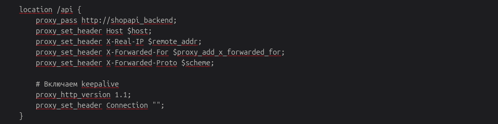  

Nginx выступает в роли обратного прокси-сервера. Все запросы к /api перенаправляются на FastAPI сервер.
Когда пользователь обращается к https://shopapi.local/api/v1/..., Nginx принимает запрос и проксирует его на бэкенд-сервер.

Посмотрим работающие процессы:

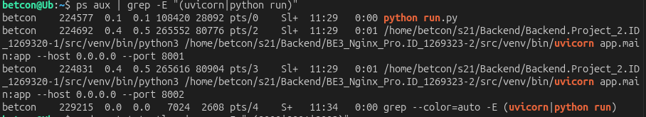  

Сетевое соединение по порту 8000 нашего Backend сервера:

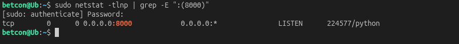  

Пример вывода заголовков с обратным проксированием: 

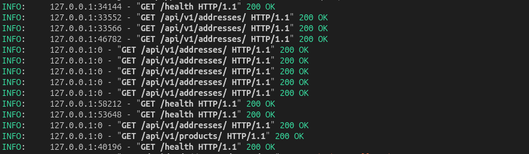  

### Задание 2. Настроить Nginx для работы веб-приложения в части маршрутизации.

1. Настрой маршрутизацию /api -> на /api/v1 разработанной тобой в блоке 2 API.

API приложение имеет роутеры с префиксом /api/v1. 

Файлы в app/api/v1/:

addresses.py → router = APIRouter(prefix="/addresses", tags=["addresses"])

clients.py → router = APIRouter(prefix="/clients", tags=["clients"])

В main.py подключаем роутеры:

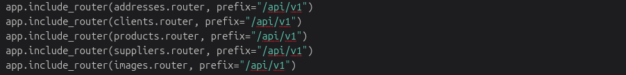  

Теперь все endpoints доступны по /api/v1/...

2. По пути /api/v1 выдавай Swagger.

Добавим редирект с /api/v1 на /docs

HTTP 301 - постоянное перенаправление"

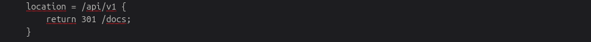  

Заходим на страницу https://shopapi.local/api/v1 и попадаем на https://shopapi.local/docs:

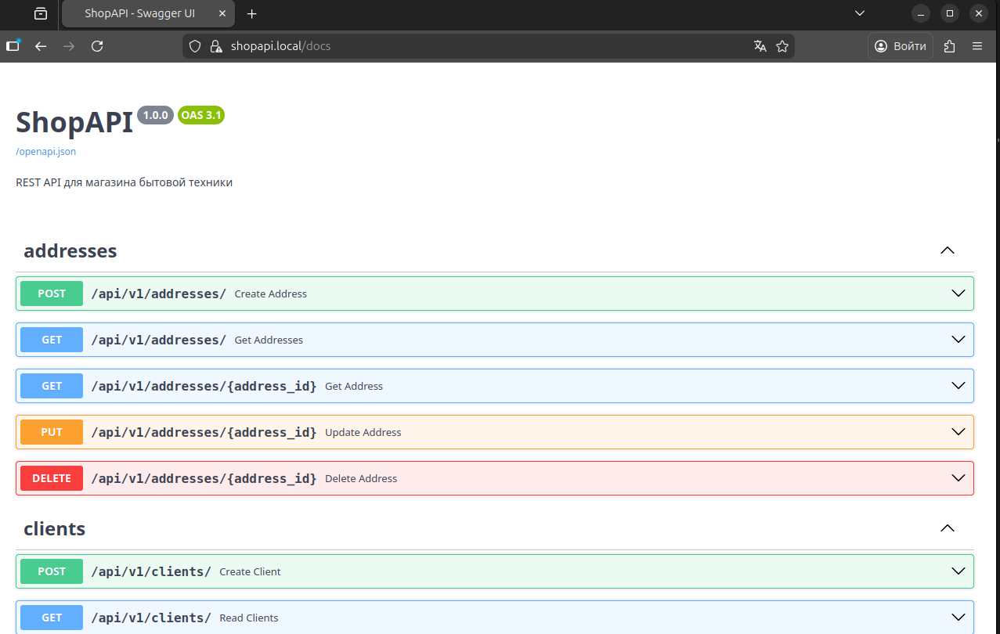  

3. Настроий раздачу статики по пути /. В корне раздачи статики помести 2 файла: index.html и image.png.

Блок для корня (/) - главная страница:

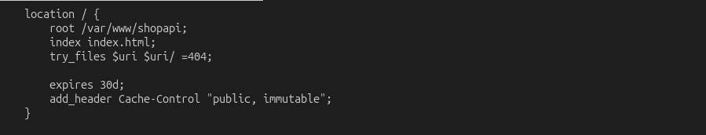  

• root /var/www/shopapi;   - Директория со статическими файлами

• index index.html;        - Индексный файл по умолчанию

• try_files $uri $uri/ =404; - Поиск файла или отдача 404

• expires 30d;             - Кэширование на 30 дней

• add_header Cache-Control "public, immutable"; - Заголовки кэша

Блок для изображений:

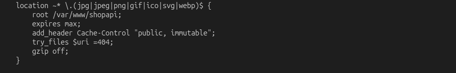  

• location ~* \.(jpg|jpeg|png|gif|ico|svg|webp)$ - Регулярное выражение

• expires max;             - Максимальное время кэширования

• add_header Cache-Control "public, immutable"; - Заголовки кэша

• try_files $uri =404;    - Поиск конкретного файла

• gzip off;               - Отключение сжатия для бинарных файлов

Проверим содержание корня раздачи:

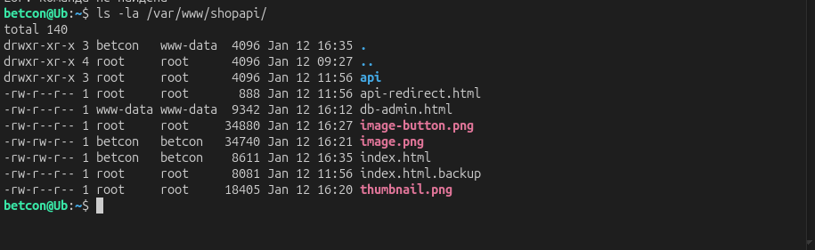  

4. Настрой /admin на pgAdmin — GUI СУБД POSTGRES.

Блок location /admin:

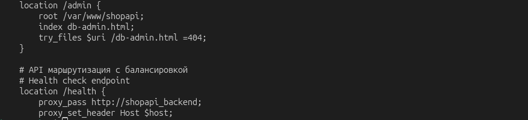  

• location /admin - обрабатывает все запросы, начинающиеся с /admin

• root /var/www/shopapi - директория с файлами

• index db-admin.html - индексный файл для этого location

• try_files $uri /db-admin.html =404 - поиск файла или отдача db-admin.html

 Заходим с главной страницы ShopAPI в pgAdmin и проверяем работоспособность:

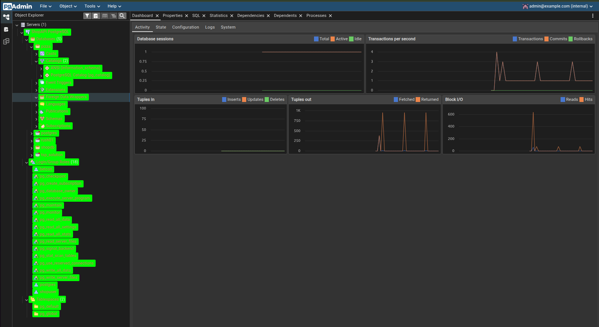   

5. Настрой /status на отдачу страницы статуса сервера Nginx (nginx status).

Добавим блок location /nginx_status в конфигурационный файл:

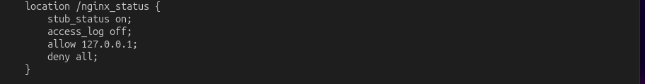   

На главной странице https://shopapi.local/ зайдем в Статус Nginx и посмотрим информацию:

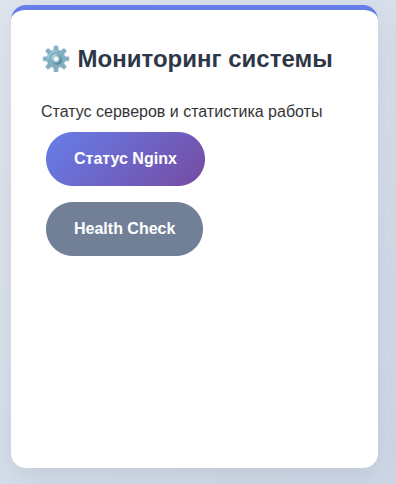   

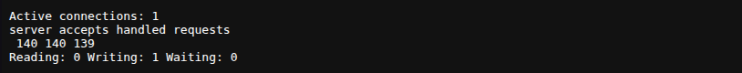   

### Задание 3. Настрой Nginx в части балансировки.

1. Запустим еще 2 инстанса бэкенда на других портах с правами доступа в базу данных только на чтение и настроим балансировку GET запросов к /api/v1 (/api/v2) в NGINX на 3 бэкенда в соотношении 2:1:1, где первый — основной бэкенд-сервер.

Добавим в в конфиг файл группу бэкенд-серверов:

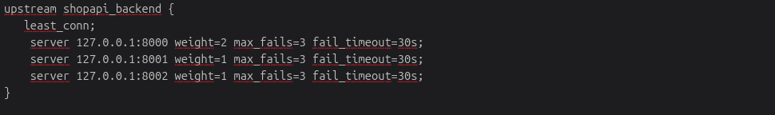  

• upstream shopapi_backend - группа бэкенд-серверов

• least_conn - метод балансировки (наименьшее количество соединений)

• server 127.0.0.1:8000 weight=2 - основной сервер с весом 2

• server 127.0.0.1:8001 weight=1 - второй сервер с весом 1 (read-only)

• server 127.0.0.1:8002 weight=1 - третий сервер с весом 1 (read-only)

• max_fails=3 - максимальное количество ошибок

• fail_timeout=30s - время ожидания после ошибки

Соотношение 2:1:1:

• Основной сервер (порт 8000): вес 2 → 50% трафика

• Дополнительные серверы (порты 8001, 8002): вес 1 → по 25% трафика

• Итого: 2 + 1 + 1 = 4 части

• 8000: 2/4 = 50% запросов

• 8001: 1/4 = 25% запросов  

• 8002: 1/4 = 25% запросов

Проверим порты:

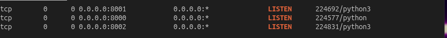  

Для настройки режима read-only на двух дополнительных серверах добавим блокировку модифицирующих методов в main.py:

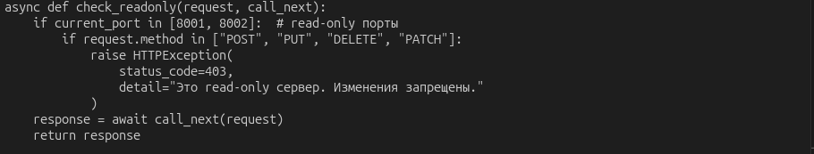  

Запустим все 3 сервера:

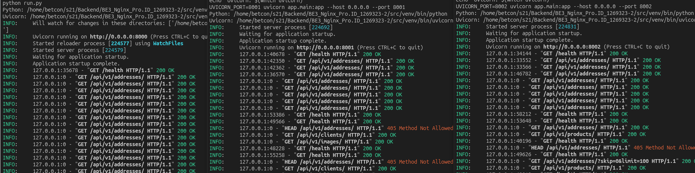  

Отправим 12 запросов и проверим балансировку:

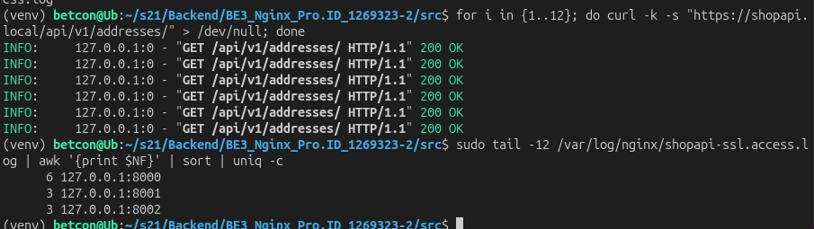  

Проверим что метод POST разрешен тольно на порту 8000 на основном сервере и запрещен на двух дополнительных 8001 и 8002:

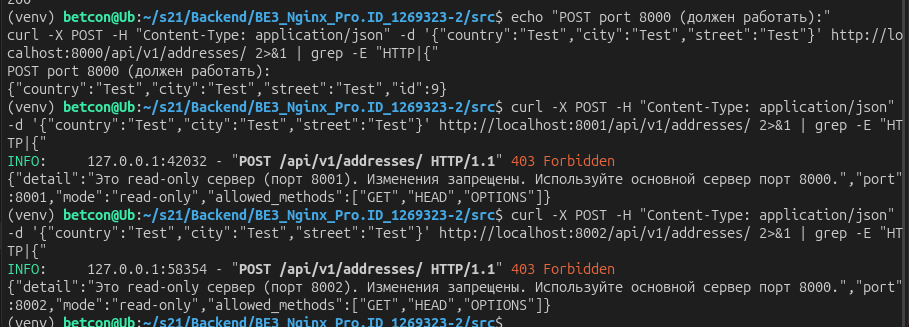  

2. Настроим кеширование (для всех GET-запросов, кроме /api).

Внесем необходимые изменения в конфиг: 

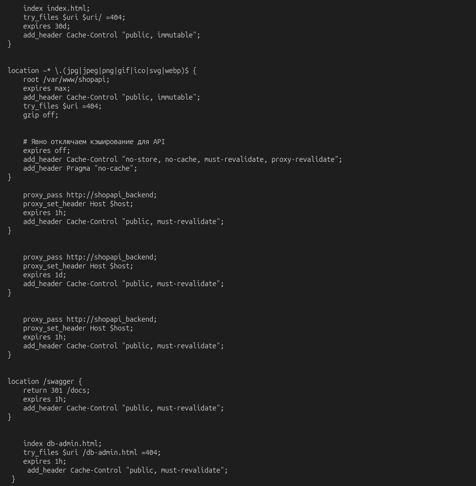  

3. Настроим gzip-сжатие в Nginx. Сжатие не должно распространяться на медиа-типы (jpeg, png и т. д.).

Добавим необходимые блоки в nginx.conf:

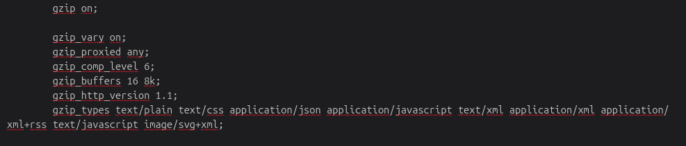  

gzip on;                        # Включает gzip сжатие ответов сервера
gzip_vary on;                   # Добавляет заголовок Vary: Accept-Encoding для правильного кэширования
gzip_proxied any;               # Разрешает сжатие для всех проксированных запросов
gzip_comp_level 6;              # Уровень сжатия от 1 до 9 (6 = оптимальный баланс)
gzip_buffers 16 8k;             # 16 буферов по 8KB = 128KB памяти для обработки сжатия
gzip_http_version 1.1;          # Минимальная версия HTTP для использования gzip

Типы MIME для сжатия (только текстовые форматы)
gzip_types                      
    text/plain                  # Простой текст (TXT, README и т.д.)
    text/css                    # CSS стили
    application/json            # JSON данные 
    application/javascript      # JavaScript файлы 
    text/xml                    # XML документы
    application/xml             # XML документы
    application/xml+rss         # RSS фиды
    text/javascript             # JavaScript 
    image/svg+xml;              # SVG изображения (XML-формат)

Следующие типы НЕ сжимаются - они автоматически исключаются, потому что не входят в список gzip_types.

- image/jpeg, image/jpg     
- image/png              
- image/gif                  
- image/webp               
- image/bmp                  
- video/*                     
- audio/*                     
- application/pdf             
- application/zip             
- application/gzip            
- font/*                      

### Задание 4. Настроить HTTPS на локальном устройстве.

1. Создадим доменное имя в локальном DNS-сервере. Добавим в файл /etc/hosts запись shopapi.local:

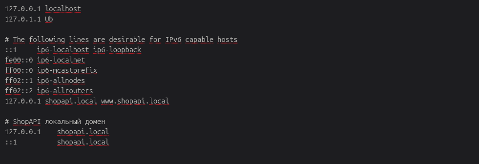  

2. Создание самоподписанного сертификата с использованием openssl для созданного доменного имени и привязать его в Nginx-конфиге.

Создаем необходимы директории, создаем самоподписанный сертификат и проверяем информацию о сертификате.

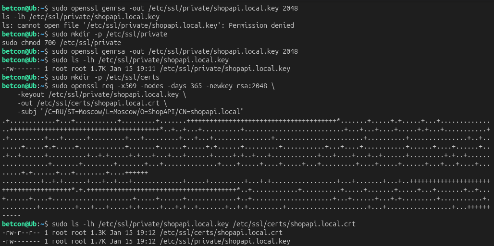  

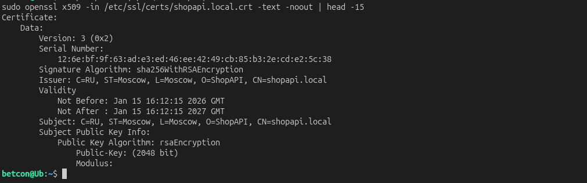  

Добавляем в конфиг shopapi-ssl.conf информацию о сертификате. Так же в блок server добавим порт 443 для работы по протоколу HTTPS.

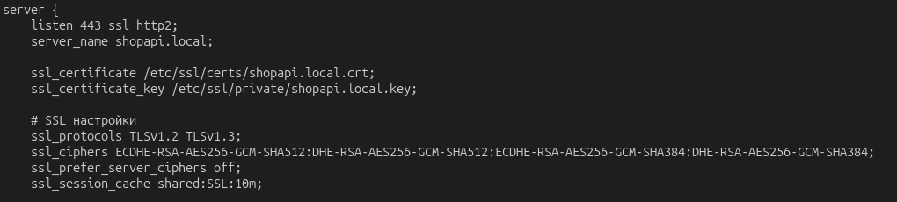  

3. Настройка reverse proxy на запущенное приложение.

  

Проверяем работу. Сделаем тестовый GET запрос с заголовками:

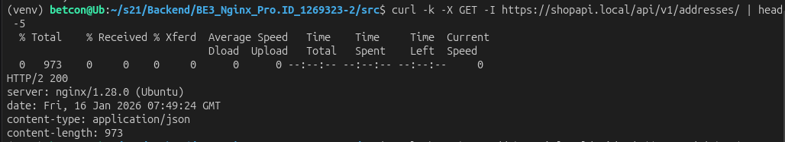  

HTTP/2 200 - Успешный ответ через HTTP/2 протокол

server: nginx/1.28.0 (Ubuntu) - Запрос обработан Nginx через reverse proxy.

content-type: application/json - Правильный тип данных (JSON)

content-length: 973 - Размер ответа 973 байта

Сделаем тестовый GET запрос с данными:

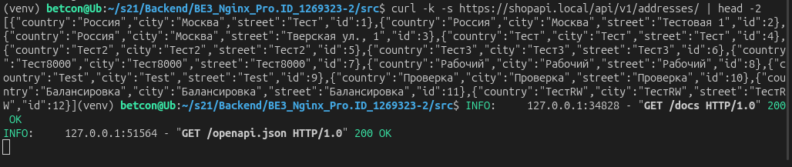  

Данные успешно получены через HTTPS → Nginx → FastAPI

В базе 12 записей (id: 1-12), включая тестовые данные

Reverse proxy передает запросы корректно к бэкенду

Балансировка нагрузки работает - запросы распределяются по 3 серверам

SSL/TLS работает - соединение защищено.

