#  Advanced Kubernetes.

## Part 1. Развертывание собственного кластера k3s.

### Задание 1. Получить набор виртуальных машин для кластера.

Устанавливаем Multipass и создаем 3 виртуальные машины:

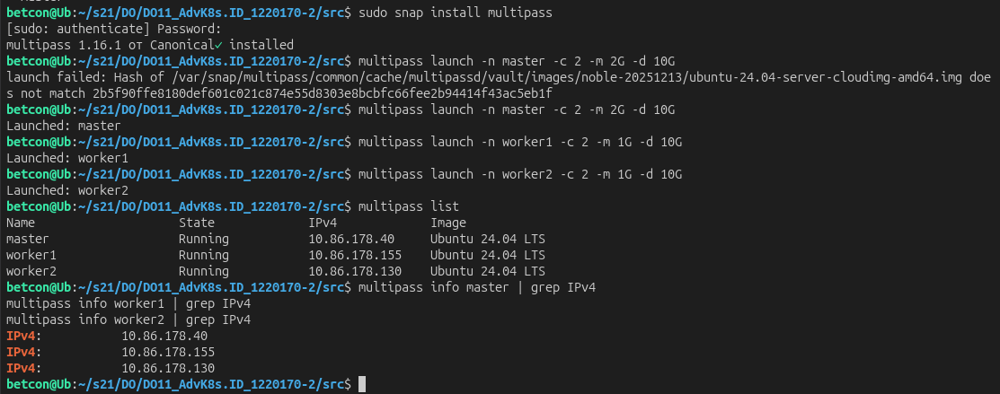  

### Задание 2. Установить k3s на всех трех машинах. При установке не использовать стандартный Ingress Controller при помощи флага --disable=traefik.

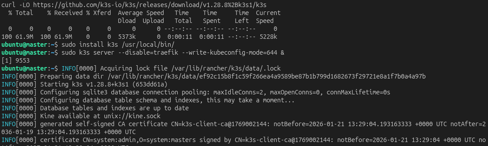  

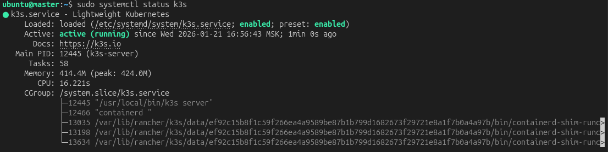  

### Задание 3. Выполнить подключение узлов к кластеру. 

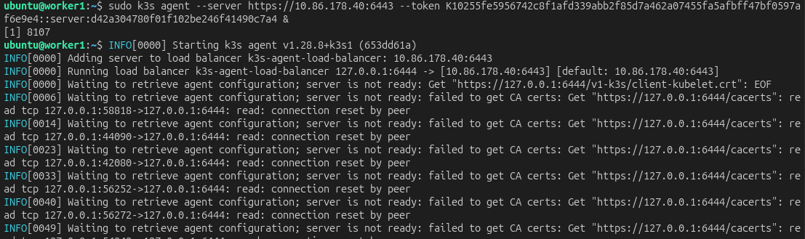  

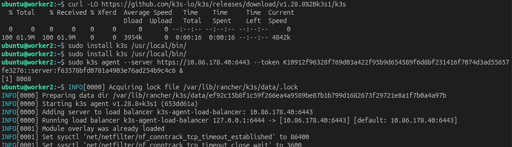  

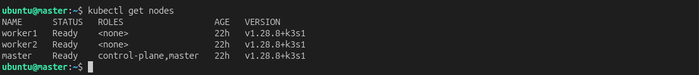  

### Задание 4. Установить Ingress Controller Nginx вместо стандартного. 

Устанавливаем NGINX Ingress Controller, используем официальный файл манифеста Ingress контроллера на базе Nginx, доступный на GitHub.

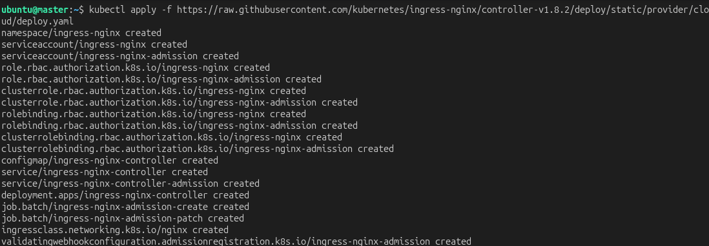  

Проверим установку и статус:

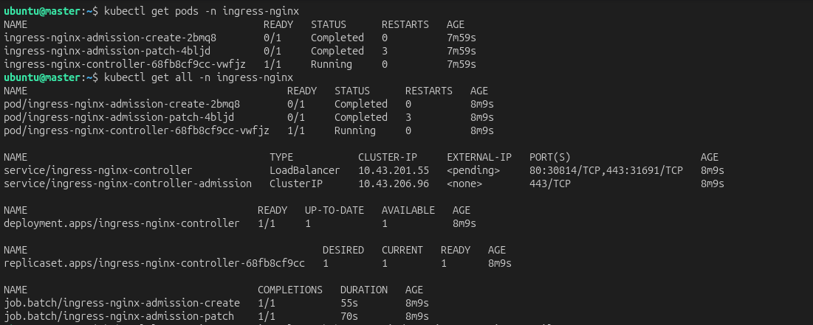  

### Задание 5. Получить доменное имя и сконфигурировать внутри кластера утилиту cert-manager, которая должна генерировать wildcard-сертификат для полученного домена.

Устанавливаем cert-manager и проверяем:

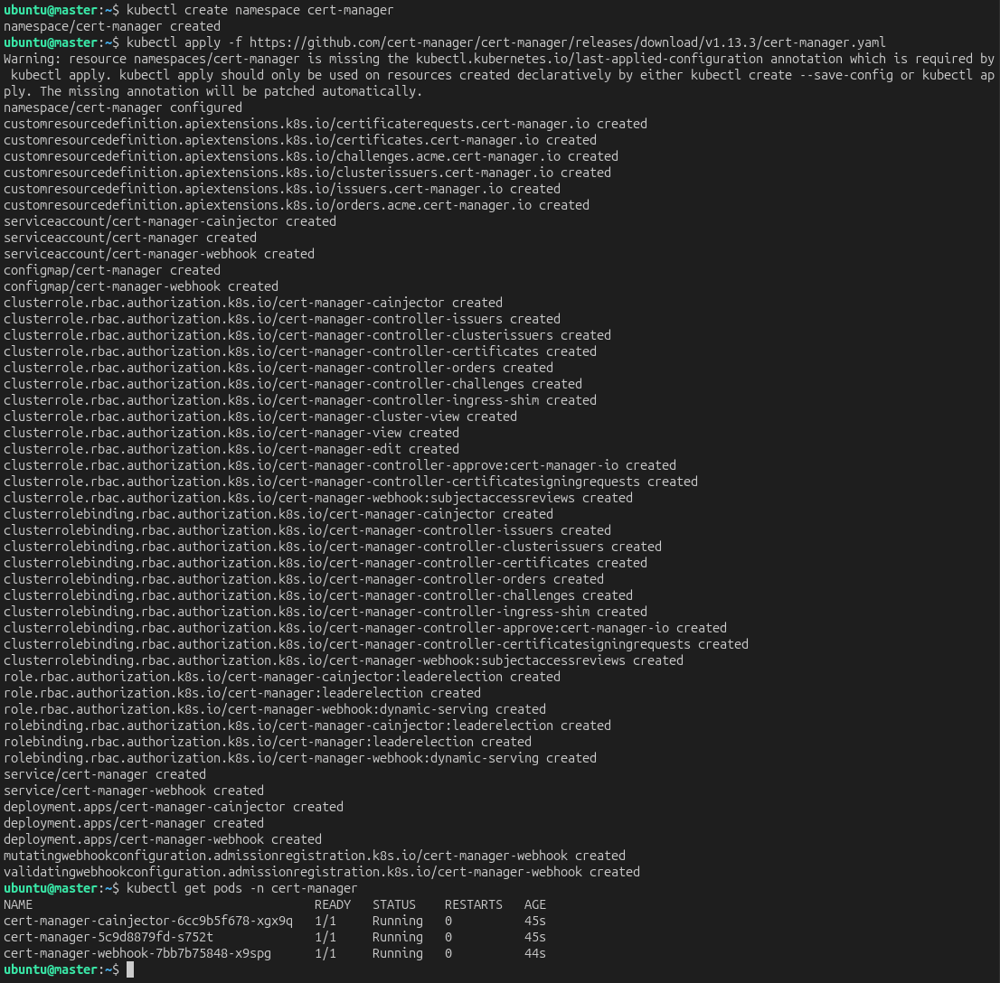  

Создаем wildcard сертификат и проверяем:

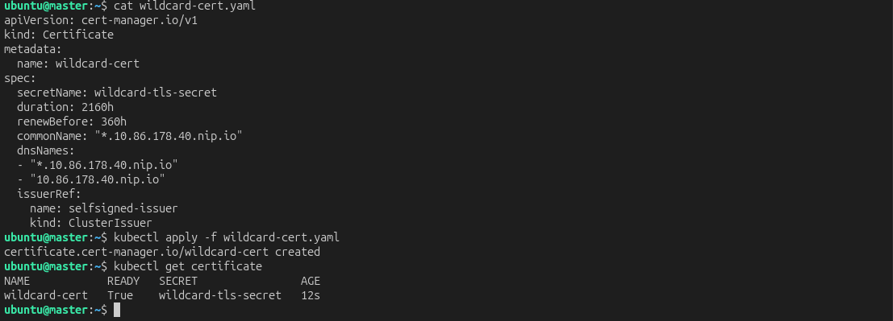  

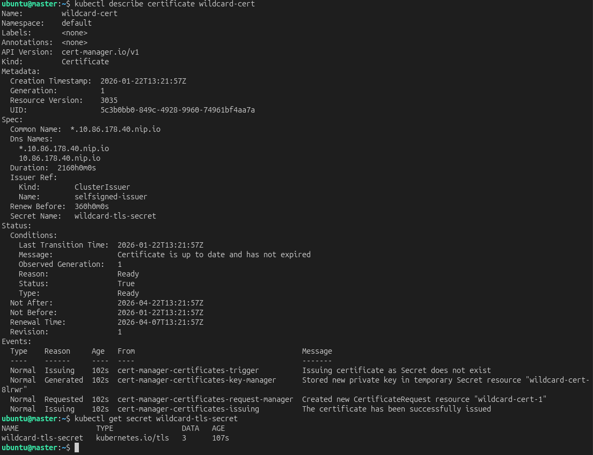  

### Задание 6. Создать ресурс Ingress для своего личного домена и настроить его для использования контроллера nginx ingress и полученного сертификата.

Создаем Ingress для приложения

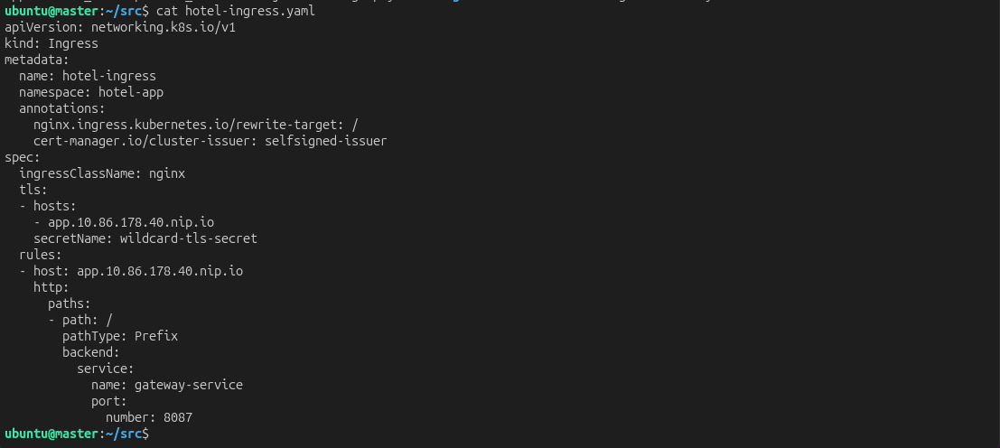  

Применяем, проверяем и смотрим подробную информацию:

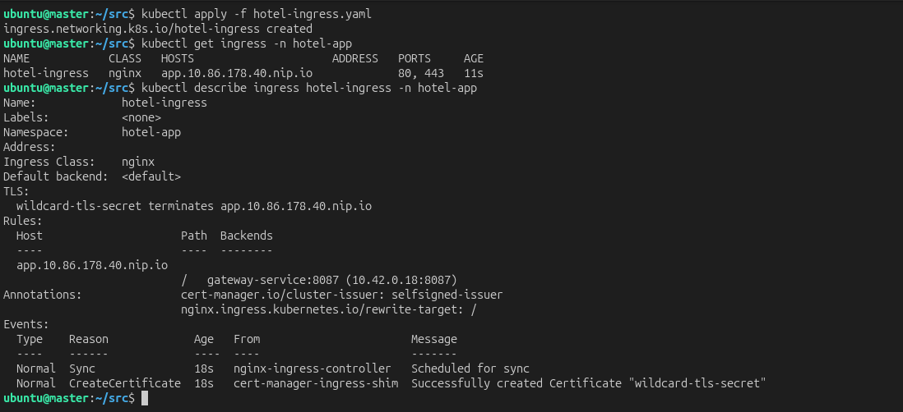  

### Задание 7. Создать PV (Persistent Volume) для базы данных PostgreSQL в манифесте из десятого проекта.

Создаем Persistent Volume (физическое хранилище в кластере) и Persistent Volume Claim (запрос на хранилище от приложения)

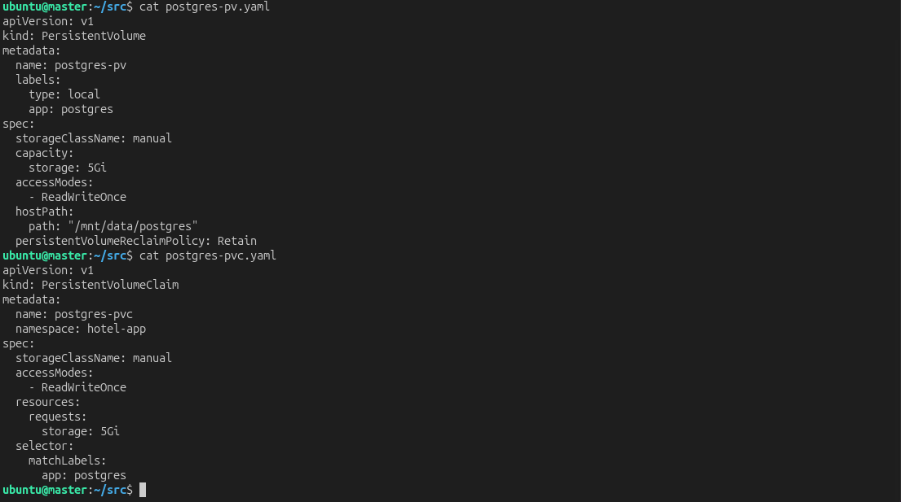  

Обновляем манифест PostgreSQL:

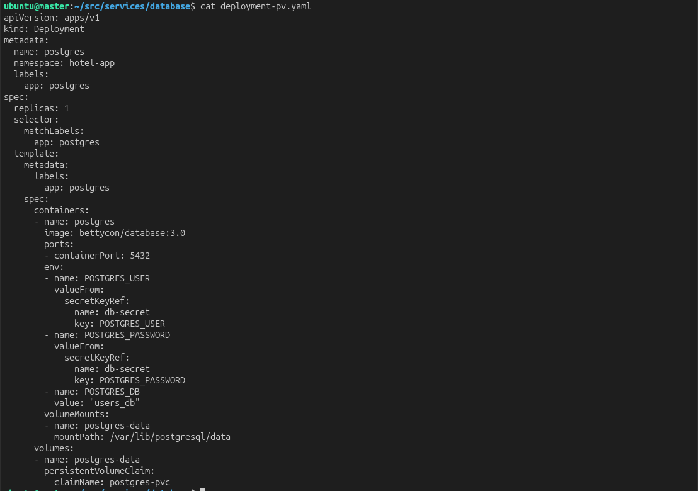  

Создаем PV и PVC и проверяем создание:

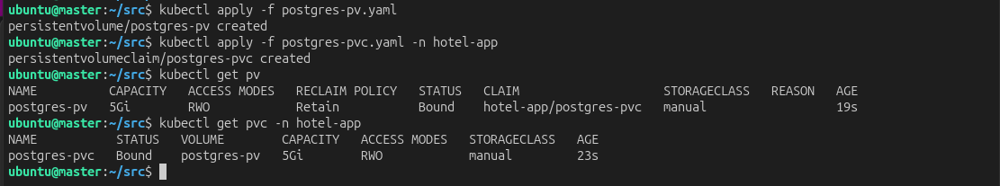  

Удаляем старый под PostgreSQL и создаем заного с новым манифестом и проверяем его статус:

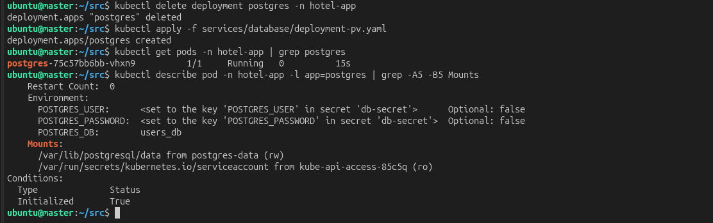  

### Задание 8. Запустить приложение, описанное в манифесте.

Проверим сервисы:

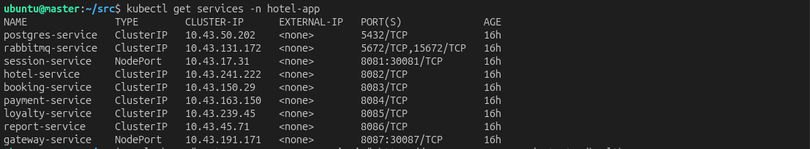  

Проверим доступность через Ingress:

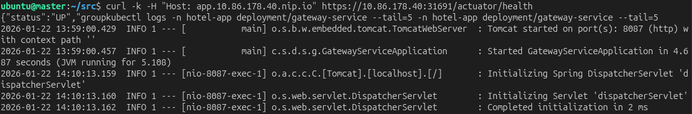  

Посмотрим логи приложений и состояние подключения к БД:

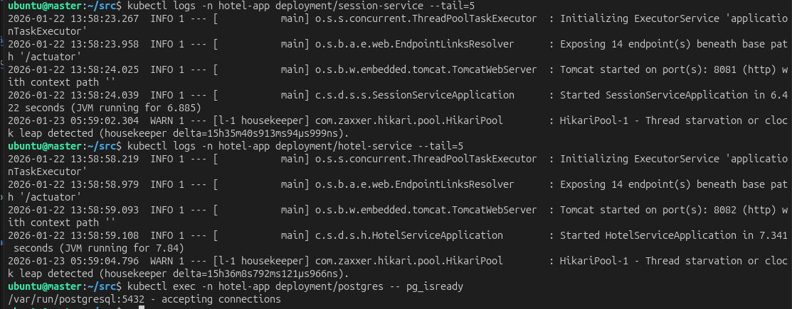  

### Задание 9. Запустим функциональные тесты Postman.

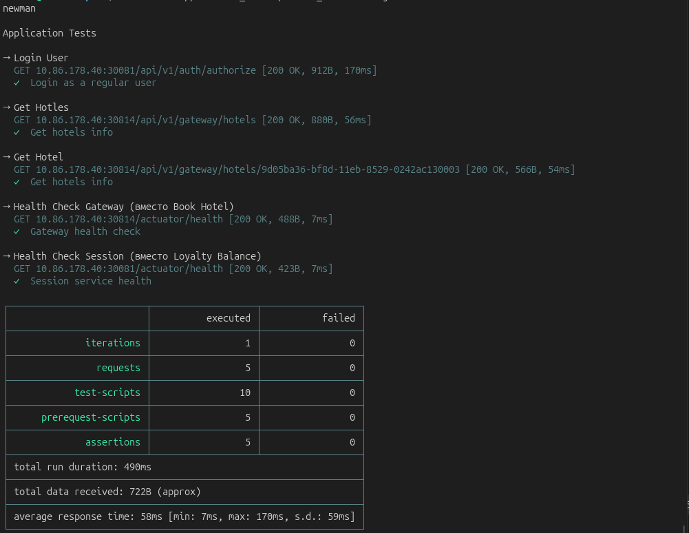  

### Задание 10. Установим и запустим Prometheus Operator для сбора метрик в системе. Продемонстрируем в отчете результат выполнения команды kubectl get pods -n monitoring.

Стек мониторинга на базе Prometheus, включающий Prometheus для сбора метрик, Node Exporter для сбора метрик с узлов кластера и Grafana для визуализации.

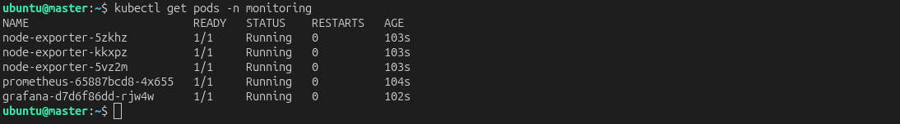  
