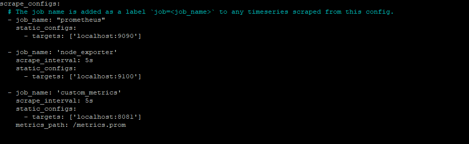
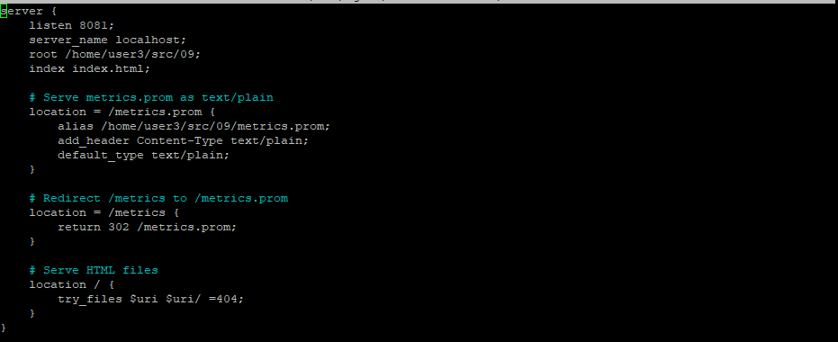
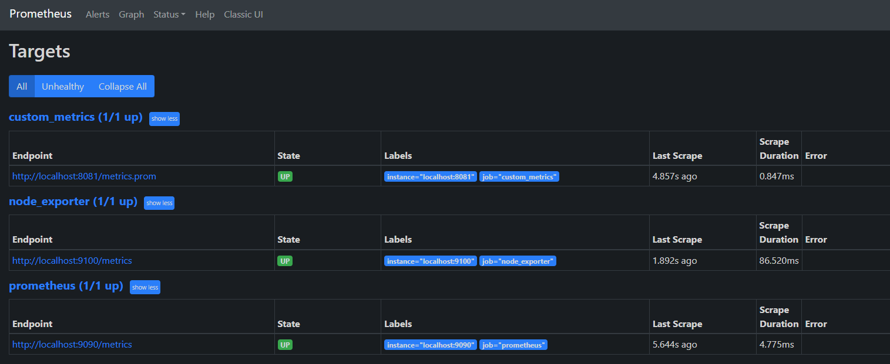
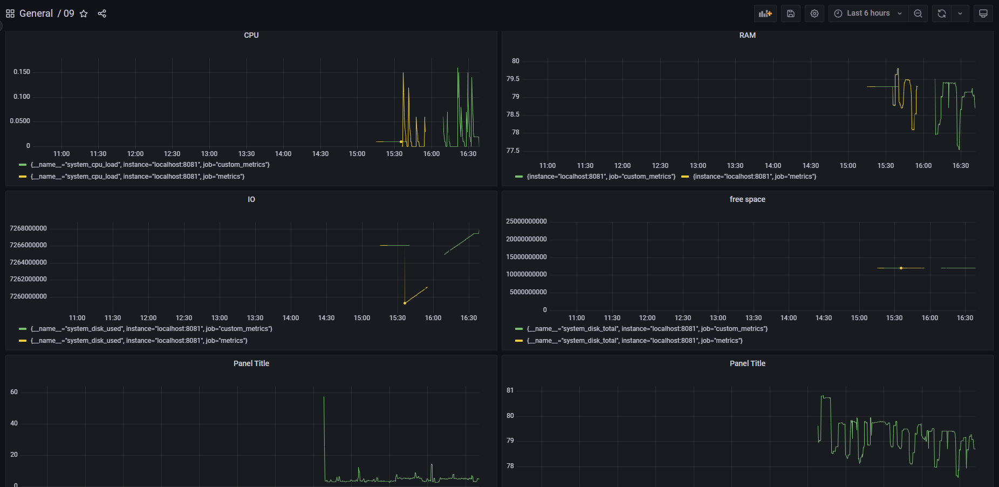
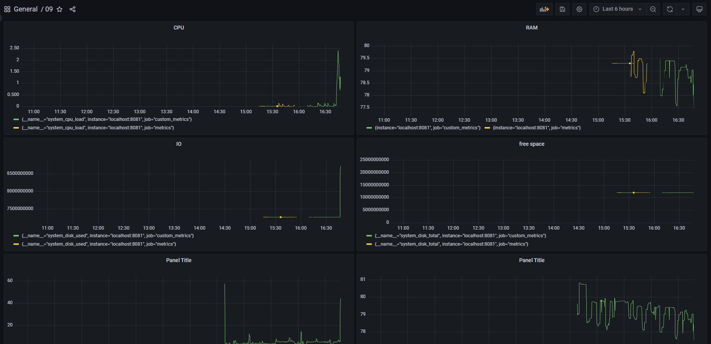
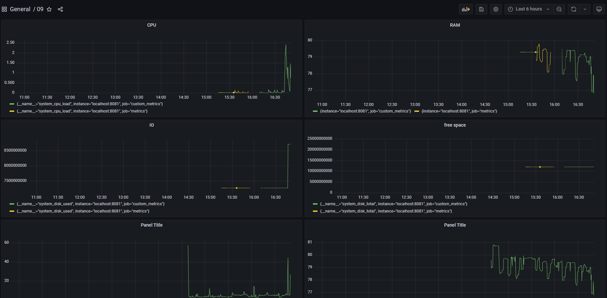

## Дополнительно. Свой node_exporter

1) Поменяем конфиг файл Prometheus, чтобы он собирал информацию с созданной  странички.  

2) Поменяем конфиг Nginx   

3) В прометеусе посмотрим что всё успешно поднялось  

4) Добавляем в ДашБорд новые панели, которые берут данные с localhost:8081

5) После запуска скрипта из части2

6) После запуска утилиты stress

