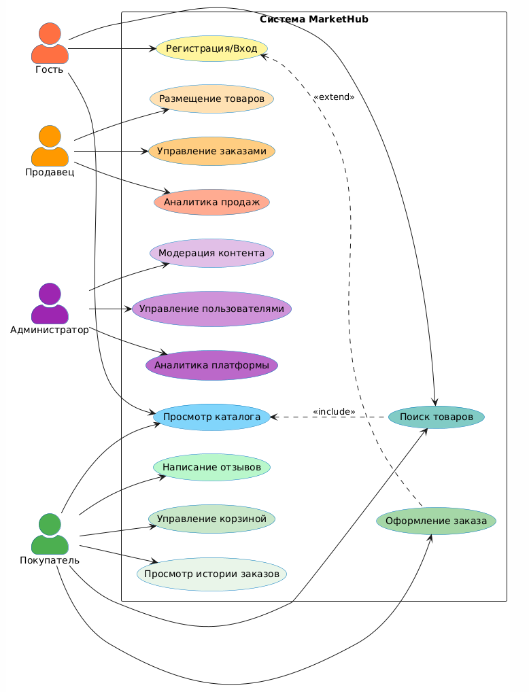
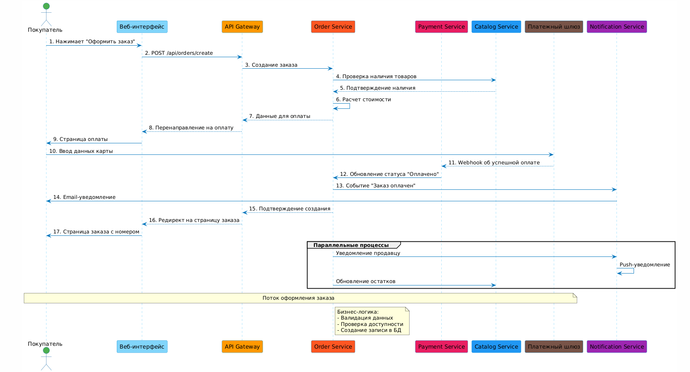
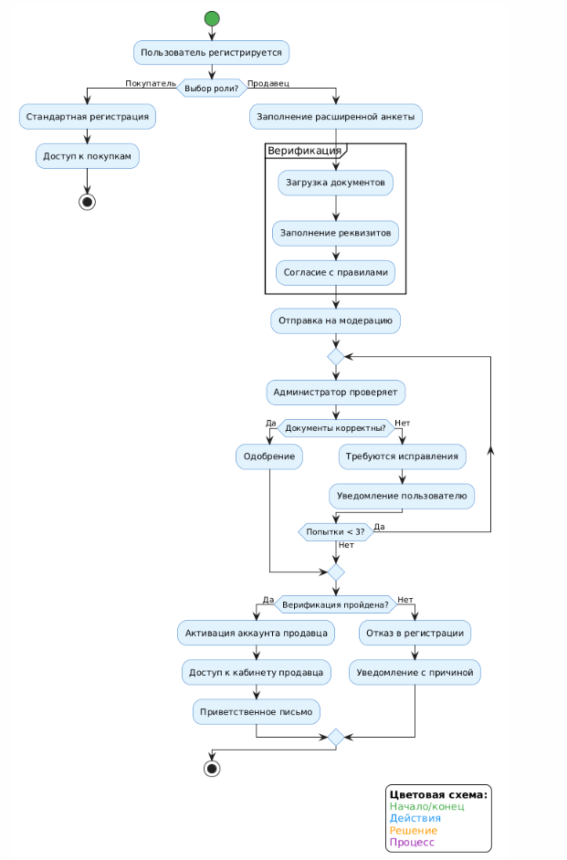
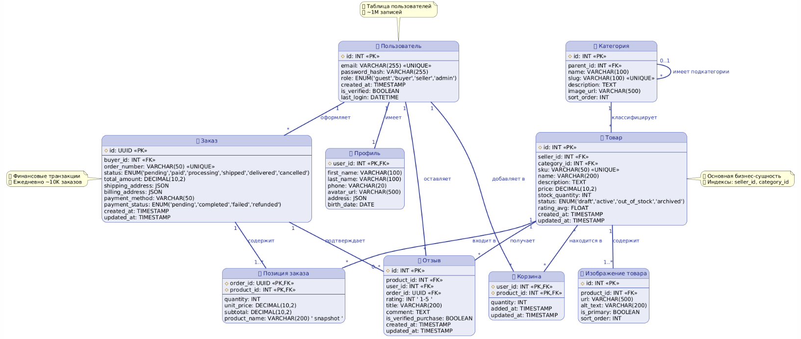
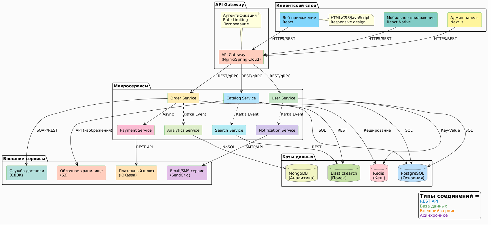
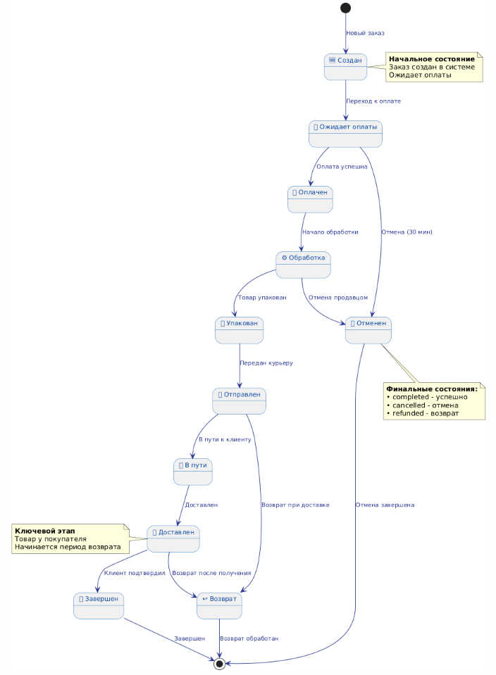
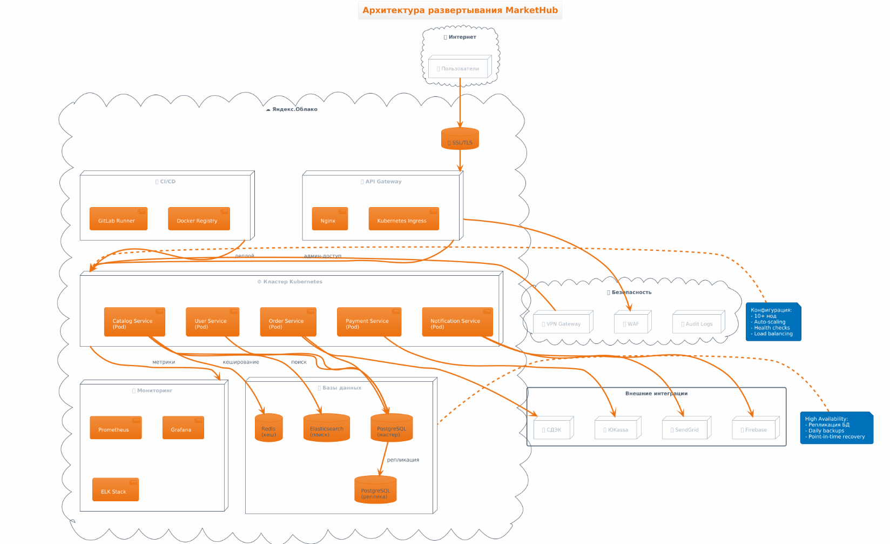

# Software Requirements Document (SRD) для платформы электронной коммерции «MarketHub»

**Версия документа:** 1.0  
**Дата создания:** 18.01.2026  
**Статус:** Черновик для согласования

---

## Содержание

- [1. Введение](#1-введение)
  - [1.1. Цель](#11-цель)
  - [1.2. Область применения](#12-область-применения)
  - [1.3. Определения, акронимы и сокращения](#13-определения-акронимы-и-сокращения)
  - [1.4. Обзор документа](#14-обзор-документа)
- [2. Общее описание](#2-общее-описание)
  - [2.1. Перспектива продукта и анализ аналогов](#21-перспектива-продукта-и-анализ-аналогов)
  - [2.2. Пользовательские классы и характеристики](#22-пользовательские-классы-и-характеристики)
  - [2.3. Допущения и зависимости](#23-допущения-и-зависимости)
  - [2.4. Use-case диаграммы и описания](#24-use-case-диаграммы-и-описания)
- [3. Требования к системе](#3-требования-к-системе)
  - [3.1. Функциональные требования (FURPS: Functionality)](#31-функциональные-требования-furps-functionality)
  - [3.2. Нефункциональные требования](#32-нефункциональные-требования)
- [4. Архитектура системы](#4-архитектура-системы)
  - [4.1. Концептуальная модель данных](#41-концептуальная-модель-данных)
  - [4.2. Компонентная архитектура](#42-компонентная-архитектура)
  - [4.3. Протоколы взаимодействия и внешние интерфейсы](#43-протоколы-взаимодействия-и-внешние-интерфейсы)
  - [4.4. Диаграмма состояний](#44-диаграмма-состояний)
- [5. Применяемые технологии и ключевые решения](#5-применяемые-технологии-и-ключевые-решения)
- [6. Тестирование и верификация](#6-тестирование-и-верификация)
  - [6.1. План тестирования](#61-план-тестирования)
  - [6.2. Критерии приемки](#62-критерии-приемки)
- [7. Развертывание и сопровождение](#7-развертывание-и-сопровождение)
- [8. Приложения и источники](#8-приложения-и-источники)

---

## 1. Введение

### 1.1. Цель
Целью данного документа (SRD) является определение полного перечня требований к программному обеспечению «MarketHub» — платформы для электронной коммерции, связывающей продавцов и покупателей. Документ служит основой для проектирования, разработки, тестирования, внедрения системы и является единым источником истины для всех стейкхолдеров проекта.

### 1.2. Область применения
Система «MarketHub» предназначена для:
* **Продавцов (Sellers):** Размещения и управления каталогом товаров, обработки заказов, взаимодействия с покупателями и анализа продаж.
* **Покупателей (Buyers):** Поиска, выбора, покупки товаров, отслеживания заказов и оставления обратной связи.
* **Администраторов (Administrators):** Управления платформой, модерации контента, поддержки пользователей и анализа общей эффективности маркетплейса.

Продукт включает веб-приложение, мобильное приложение и административную панель.

### 1.3. Определения, акронимы и сокращения
| Термин / Аббревиатура | Расшифровка / Определение |
|-----------------------|----------------------------|
| SRD | Software Requirements Document — Документ требований к программному обеспечению |
| SRS | Software Requirements Specification — Спецификация требований к программному обеспечению |
| ПО | Программное обеспечение |
| UX/UI | User Experience / User Interface — Пользовательский опыт / Пользовательский интерфейс |
| API | Application Programming Interface — Программный интерфейс приложения |
| БД | База данных |
| SSL/TLS | Secure Sockets Layer / Transport Layer Security — Протоколы шифрования сетевого соединения |
| GDPR | General Data Protection Regulation — Общий регламент по защите данных (ЕС) |
| Use Case | Вариант использования — сценарий взаимодействия пользователя с системой |

### 1.4. Обзор документа
Документ структурирован следующим образом: после введения дается общее описание продукта, включая анализ аналогов и пользовательские сценарии. Далее детализируются функциональные и нефункциональные требования, описывается архитектура, технологии, план тестирования и развертывания.

**[⬆ Наверх](#содержание)**

## 2. Общее описание

### 2.1. Перспектива продукта и анализ аналогов
«MarketHub» позиционируется как универсальная платформа электронной коммерции с акцентом на **интуитивность интерфейса**, **безопасность транзакций** и **персонализацию** (рекомендательная система).

**Ключевые конкуренты и отличия:**
1. **Wildberries / Ozon:** Крупные игроки с огромным ассортиментом. *Отличие MarketHub:* Более гибкие условия для малого и среднего бизнеса, упрощенная процедура входа для продавцов, современный и минималистичный UX.
2. **Avito / Юла:** Площадки с акцентом на частные объявления. *Отличие MarketHub:* Интегрированная и безопасная система платежей, строгая верификация продавцов, система гарантий для покупателей, полноценная корзина и оформление заказа.
3. **Тематические нишевые маркетплейсы:** *Отличие MarketHub:* Универсальность, поддержка широкого спектра категорий товаров.

**Перспективы:** Фокус на создание безопасной и удобной экосистемы для честных продавцов и покупателей, что позволит занять устойчивую нишу на рынке.

### 2.2. Пользовательские классы и характеристики
1. **Незарегистрированный пользователь (Гость):** Может просматривать каталог товаров, использовать поиск и фильтры. Для совершения покупок и доступа к персонализированным функциям требуется регистрация.
2. **Зарегистрированный пользователь:**
   * **Покупатель:** Основной пользователь. Может совершать покупки, управлять профилем, корзиной, заказами, оставлять отзывы.
   * **Продавец:** Может размещать и управлять товарами, обрабатывать заказы, просматривать аналитику и отзывы. Требуется дополнительная верификация для получения статуса продавца.
3. **Администратор:** Сотрудник платформы. Имеет полный доступ к управлению пользователями, товарами, заказами, контентом и аналитикой. Работает через отдельную административную панель.

### 2.3. Допущения и зависимости
* **Допущения:**
  1. Пользователи имеют доступ к интернету и современному веб-браузеру или смартфону.
  2. Продавцы самостоятельно обеспечивают качество фотографий и описаний товаров.
  3. Платежные системы-партнеры обеспечивают надежность и безопасность проведения транзакций.
* **Зависимости:**
  1. Доступность и стабильность работы внешних платежных шлюзов (например, ЮKassa, Stripe).
  2. Наличие SMS- или email-сервиса для отправки уведомлений.
  3. Возможность развертывания на облачной инфраструктуре (например, Яндекс.Облако, AWS).

### 2.4. Use-case диаграммы и описания

**Use Case Диаграмма:**

  

**Детализированные Use Case описания:**

**Use Case 1: Просмотр каталога и поиск товара**
* **Актор:** Гость, Покупатель
* **Основной поток:** Пользователь открывает главную страницу, использует строку поиска или категории для навигации. Применяет фильтры (цена, рейтинг) и сортировку. Просматривает карточки товаров

**Use Case 2: Оформление заказа**

  

* **Актор:** Покупатель (зарегистрированный)
* **Предусловие:** Пользователь авторизован, в корзине есть товары
* **Основной поток:** Пользователь переходит в корзину, проверяет состав, выбирает адрес доставки и способ оплаты. Подтверждает заказ. Система перенаправляет его на страницу оплаты внешнего шлюза. После успешной оплаты создается заказ, отправляются уведомления
* **Постусловие:** Создан новый заказ со статусом «Оплачен»

**Use Case 3: Размещение нового товара**

  

* **Актор:** Продавец
* **Предусловие:** Пользователь авторизован и имеет статус «Верифицированный продавец»
* **Основной поток:** Продавец в личном кабинете выбирает «Добавить товар». Заполняет форму: название, описание, категория, цена, загружает фотографии. Нажимает «Опубликовать». Система проверяет данные и публикует товар (возможно, с задержкой на модерацию)
* **Постусловие:** Новый товар появляется в каталоге

**Use Case 4: Модерация товара**
* **Актор:** Администратор
* **Основной поток:** Администратор в панели управления видит очередь товаров, ожидающих модерации. Открывает карточку товара, проверяет описание и фотографии на соответствие правилам. Одобряет публикацию или отклоняет с указанием причины
* **Постусловие:** Статус товара меняется на «Опубликован» или «Отклонен»

**[⬆ Наверх](#содержание)**

## 3. Требования к системе

### 3.1. Функциональные требования (FURPS: Functionality)
**FR-01. Управление пользователями и аутентификация**
* FR-01.01: Система должна предоставлять форму регистрации для новых пользователей (email/телефон, пароль)
* FR-01.02: Система должна предоставлять форму входа для зарегистрированных пользователей
* FR-01.03: Система должна поддерживать восстановление пароля через email
* FR-01.04: Система должна различать роли: Гость, Покупатель, Продавец, Администратор
* FR-01.05: Для получения роли «Продавец» пользователь должен заполнить расширенную анкету и пройти верификацию администратором

**FR-02. Управление каталогом товаров**
* FR-02.01: Продавец может создавать, редактировать, деактивировать карточки товаров
* FR-02.02: Карточка товара должна содержать: название, описание, несколько фотографий, цену, категорию, характеристики, остаток на складе
* FR-02.03: Система должна предоставлять поиск по названию и описанию товара
* FR-02.04: Система должна предоставлять фильтры (по категории, цене, рейтингу продавца) и сортировку (по цене, популярности, новизне)

**FR-03. Корзина и оформление заказа**
* FR-03.01: Покупатель может добавлять товары в корзину и изменять их количество
* FR-03.02: Система должна рассчитывать итоговую стоимость заказа с учетом доставки
* FR-03.03: Система должна предоставлять процесс оформления заказа с шагами: выбор адреса, способа доставки и оплаты
* FR-03.04: Система должна интегрироваться с внешним платежным шлюзом для приема оплаты

**FR-04. Управление заказами**
* FR-04.01: Покупатель может просматривать историю своих заказов и текущий статус каждого заказа
* FR-04.02: Продавец может просматривать заказы по своим товарам и менять их статус (например, «Собран», «Передан в доставку»)
* FR-04.03: Система должна автоматически обновлять статус заказа при получении подтверждения от платежной системы и службы доставки (через API)

**FR-05. Система рейтингов и отзывов**
* FR-05.01: Покупатель, совершивший покупку, может оставить отзыв и оценку (1-5 звезд) товару и продавцу
* FR-05.02: Средний рейтинг продавца и товара должен отображаться на соответствующих страницах

**FR-06. Рекомендательная система**
* FR-06.01: Система должна отображать блок «Рекомендуем вам» на главной странице и в карточке товара на основе истории просмотров и покупок пользователя

**FR-07. Административная панель**
* FR-07.01: Администратор может просматривать, блокировать и удалять пользователей
* FR-07.02: Администратор может модерировать товары и отзывы
* FR-07.03: Администратор может просматривать аналитические отчеты (продажи, популярные товары, активность)

**FR-08. Уведомления**
* FR-08.01: Система должна отправлять email-уведомления о регистрации, изменении статуса заказа, новых отзывах
* FR-08.02: Система должна поддерживать отправку push-уведомлений в мобильное приложение

### 3.2. Нефункциональные требования
**NR-01. Удобство использования (Usability)**
* NR-01.01: Интерфейс должен соответствовать современным принципам Material Design / Apple Human Interface Guidelines
* NR-01.02: Среднее время освоения основных функций новым пользователем (оформление первого заказа) не должно превышать 5 минут
* NR-01.03: Система должна быть адаптирована для работы на мобильных устройствах (responsive design)

**NR-02. Надежность (Reliability)**
* NR-02.01: Время доступности (uptime) системы должно составлять не менее 99.5%
* NR-02.02: Система должна обеспечивать целостность и сохранность данных о транзакциях и пользователях. Автоматическое резервное копирование БД — раз в сутки
* NR-02.03: При сбое платежного шлюза заказ должен переходить в статус «Ожидание оплаты» без потери данных

**NR-03. Производительность (Performance)**
* NR-03.01: Время загрузки основной страницы каталога при среднем количестве товаров (до 10 000) не должно превышать 2 секунд
* NR-03.02: Система должна выдерживать пиковую нагрузку до 1000 одновременных пользователей
* NR-03.03: Операция поиска по каталогу должна выполняться не более чем за 1 секунду

**NR-04. Поддерживаемость (Supportability)**
* NR-04.01: Кодовая база должна быть покрыта модульными тестами не менее чем на 70%
* NR-04.02: Система должна быть спроектирована с использованием микросервисной архитектуры для возможности независимого масштабирования компонентов
* NR-04.03: Должна быть предусмотрена подробная логгирование операций для отладки и анализа инцидентов

**NR-05. Безопасность (Security)**
* NR-05.01: Все передаваемые данные должны шифроваться с использованием протокола TLS 1.3
* NR-05.02: Пароли пользователей должны храниться в БД в хешированном виде (алгоритм bcrypt или аналогичный)
* NR-05.03: Доступ к административной панели должен осуществляться только по VPN или с white-listed IP-адресов
* NR-05.04: Система должна быть защищена от основных видов атак (OWASP Top 10): SQL-инъекции, XSS, CSRF

**NR-06. Стандарты**
* Система разрабатывается с учетом рекомендаций ГОСТ Р 54869-2011 «Техническое задание на создание программного обеспечения» и ГОСТ Р ИСО/МЭК 12207-2010 «Жизненный цикл программного обеспечения»
* Обработка персональных данных должна соответствовать требованиям 152-ФЗ и принципам GDPR

**[⬆ Наверх](#содержание)**

## 4. Архитектура системы

### 4.1. Концептуальная модель данных

  

### 4.2. Компонентная архитектура

  

### 4.3. Протоколы взаимодействия и внешние интерфейсы
* **Внутреннее взаимодействие:**
  - REST API (JSON over HTTPS) для синхронных запросов между сервисами
  - Apache Kafka для асинхронной обработки событий (создание заказа, изменение статуса)
  - gRPC для высокопроизводительного взаимодействия критически важных сервисов

* **Внешние интерфейсы:**
  1. **Платежные шлюзы:** REST API интеграция с ЮKassa/Stripe для обработки платежей
  2. **Службы доставки:** SOAP/REST API интеграция с СДЭК, Boxberry для расчета стоимости и трекинга
  3. **Email/SMS сервисы:** SMTP/API интеграция с SendGrid, Twilio для отправки уведомлений
  4. **Мобильные платформы:** Firebase Cloud Messaging (FCM) для push-уведомлений
  5. **Аналитика:** API интеграция с Яндекс.Метрика, Google Analytics

### 4.4. Диаграмма состояний

  

**[⬆ Наверх](#содержание)**

## 5. Применяемые технологии и ключевые решения

**Бэкенд-технологии:**
- **Язык программирования:** Java 17+ / Spring Boot 3.x
- **Архитектура:** Микросервисы с использованием Spring Cloud
- **ORM:** Hibernate / Spring Data JPA
- **Аутентификация:** Spring Security + JWT tokens
- **Очереди сообщений:** Apache Kafka
- **API Gateway:** Spring Cloud Gateway

**Фронтенд-технологии:**
- **Веб-интерфейс:** React 18 + TypeScript + Redux Toolkit
- **Стилизация:** Tailwind CSS + Material-UI
- **Админ-панель:** Next.js 14 + shadcn/ui
- **Мобильное приложение:** React Native / Expo

**Базы данных и хранилища:**
- **Основная БД:** PostgreSQL 15 (транзакционные данные)
- **Кеширование:** Redis 7 (сессии, кеш товаров)
- **Поиск:** Elasticsearch 8 (полнотекстовый поиск товаров)
- **Файловое хранилище:** MinIO / Amazon S3 (изображения товаров)

**Инфраструктура:**
- **Контейнеризация:** Docker + Docker Compose
- **Оркестрация:** Kubernetes (для production)
- **CI/CD:** GitLab CI / GitHub Actions
- **Мониторинг:** Prometheus + Grafana + ELK Stack
- **Облачная платформа:** Яндекс.Облако / AWS

**Ключевые проектные решения:**
1. Микросервисная архитектура для независимого масштабирования компонентов
2. Event-driven архитектура для асинхронной обработки событий
3. CQRS (Command Query Responsibility Segregation) для разделения операций записи и чтения
4. Circuit Breaker паттерн для устойчивости к отказам внешних сервисов

**[⬆ Наверх](#содержание)**

## 6. Тестирование и верификация

### 6.1. План тестирования
**Этап 1: Модульное тестирование (Unit Testing)**
- **Инструменты:** JUnit 5, Mockito, Testcontainers
- **Цель:** Проверка корректности отдельных компонентов и методов
- **Критерий:** Покрытие кода не менее 70%

**Этап 2: Интеграционное тестирование**
- **Инструменты:** Spring Boot Test, WireMock
- **Цель:** Проверка взаимодействия между компонентами системы
- **Фокус:** API эндпоинты, взаимодействие с БД, внешние интеграции

**Этап 3: Системное тестирование (E2E)**
- **Инструменты:** Selenium, Cypress, Playwright
- **Цель:** Проверка полных пользовательских сценариев
- **Тест-кейсы:**
  1. Регистрация нового пользователя
  2. Поиск и покупка товара
  3. Размещение товара продавцом
  4. Административная модерация

**Этап 4: Нагрузочное тестирование**
- **Инструменты:** Apache JMeter, k6
- **Цель:** Проверка производительности под нагрузкой
- **Сценарии:** Пиковая нагрузка 1000 пользователей, обработка 100 транзакций в секунду

**Этап 5: Тестирование безопасности**
- **Инструменты:** OWASP ZAP, SonarQube
- **Цель:** Выявление уязвимостей безопасности
- **Проверки:** SQL-инъекции, XSS, CSRF, аутентификация и авторизация

**Этап 6: Приемочное тестирование (UAT)**
- **Участники:** Бизнес-аналитики, конечные пользователи
- **Цель:** Подтверждение соответствия требованиям бизнеса
- **Длительность:** 2 недели тестирования на staging-среде

### 6.2. Критерии приемки
**Критические критерии (должны быть выполнены на 100%):**
1. ✅ Все функциональные требования FR-01 - FR-08 реализованы и работают корректно
2. ✅ Система проходит все E2E тест-кейсы без критических ошибок
3. ✅ Время отклика системы соответствует требованиям NR-03
4. ✅ Отчет безопасности не содержит критических уязвимостей
5. ✅ Достигнута доступность системы 99.5% в течение 30 дней тестирования

**Дополнительные критерии (желательные):**
1. ⭐ Производительность системы на 20% выше минимальных требований
2. ⭐ Пользовательский интерфейс получил положительные отзывы от фокус-группы
3. ⭐ Документация полная и понятная для всех стейкхолдеров

**[⬆ Наверх](#содержание)**

## 7. Развертывание и сопровождение

**План развертывания:**
  
1. **Подготовительный этап (2 недели):**
   - Настройка облачной инфраструктуры (VPC, Kubernetes кластер)
   - Развертывание базовых сервисов (БД, кеш, очереди)
   - Настройка CI/CD пайплайнов

2. **Этап развертывания (итеративный):**
   - Деплой на staging-среду для тестирования
   - Постепенное развертывание на production (canary deployment)
   - Мониторинг метрик производительности и ошибок

3. **Запуск и стабилизация:**
   - Постепенное увеличение нагрузки
   - Анализ логов и метрик
   - Оптимизация производительности

**Процесс сопровождения:**
- **Мониторинг:** 24/7 мониторинг системы (Prometheus, Grafana, Sentry)
- **Резервное копирование:** Ежедневное бэкапирование БД, еженедельное полное копирование
- **Обновления:** Ежемесячные патч-релизы, квартальные минорные обновления
- **Поддержка пользователей:** Helpdesk система, онлайн-чат, телефонная поддержка
- **Документация:** Актуализация документации после каждого релиза

**План аварийного восстановления:**
1. **Уровень 1:** Автоматическое восстановление (перезапуск контейнеров, failover БД) - время восстановления до 5 минут
2. **Уровень 2:** Ручное восстановление из резервных копий - время восстановления до 1 часа
3. **Уровень 3:** Полное восстановление инфраструктуры - время восстановления до 4 часов

**[⬆ Наверх](#содержание)**

## 8. Приложения и источники

### Приложение А: Глоссарий
- **Каталог товаров** — структурированная база всех товаров, доступных на платформе
- **Карточка товара** — страница с полной информацией о конкретном товаре
- **Корзина** — временное хранилище товаров, отложенных для покупки
- **Сессия пользователя** — период активности пользователя в системе после аутентификации
- **Статус заказа** — текущее состояние заказа в процессе обработки

### Приложение Б: Ссылки на документацию
1. [Макеты интерфейса (Figma)](https://www.figma.com/files/project/...)
2. [API документация (Swagger)](https://api.markethub.ru/swagger-ui.html)
3. [Репозиторий проекта (GitLab)](https://gitlab.com/markethub/platform)
4. [Дашборд мониторинга (Grafana)](https://grafana.markethub.ru)

### Приложение В: Справочные материалы
1. ГОСТ Р 54869-2011 "Техническое задание на создание программного обеспечения"
2. ГОСТ Р ИСО/МЭК 12207-2010 "Жизненный цикл программного обеспечения"
3. Федеральный закон № 152-ФЗ "О персональных данных"
4. OWASP Top 10 Security Risks
5. Material Design Guidelines
6. Apple Human Interface Guidelines

### Источники требований
- Исходные требования заказчика
- Анализ рынка электронной коммерции 2025
- Отзывы пользователей существующих платформ
- Бенчмаркинг конкурентов (Wildberries, Ozon, Яндекс.Маркет)

**[⬆ Наверх](#содержание)**

---
*Документ подготовлен в соответствии с требованиями дисциплины "Инженерия требований"*
*Дата окончания разработки требований: 18.01.2026*